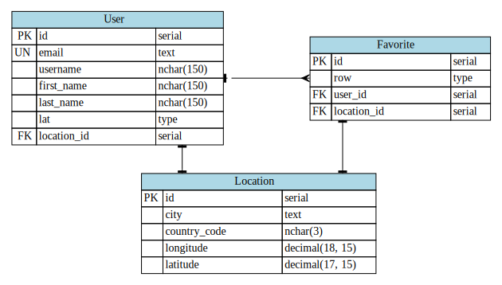

# horus

Weather app built on Django and SQLite

## Setup

```python
git clone https://github.com/woojiahao/horus.git
cd horus/
```

## Local deployment

```python
python manage.py runserver
```

## Database design



The database diagram was generated using [GraphViz](https://graphviz.org/)!
